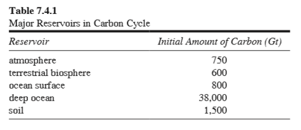
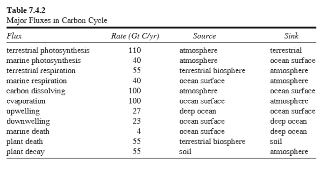
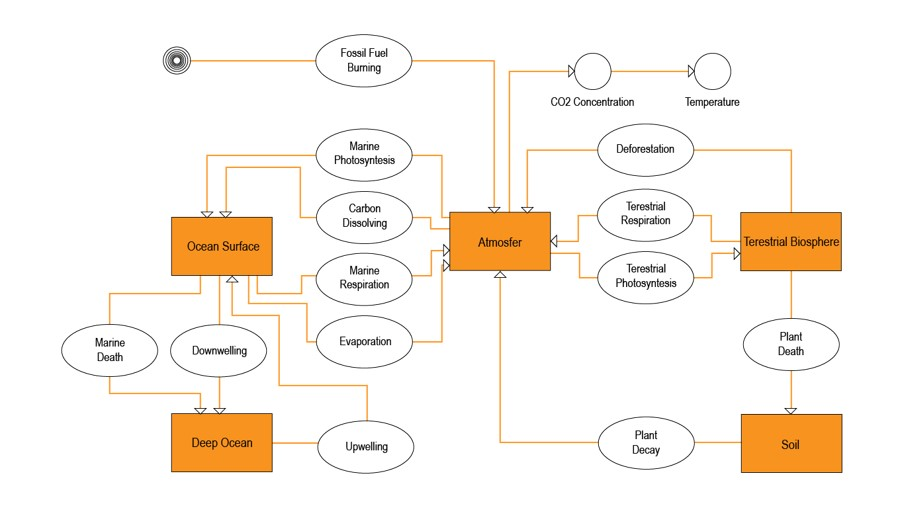
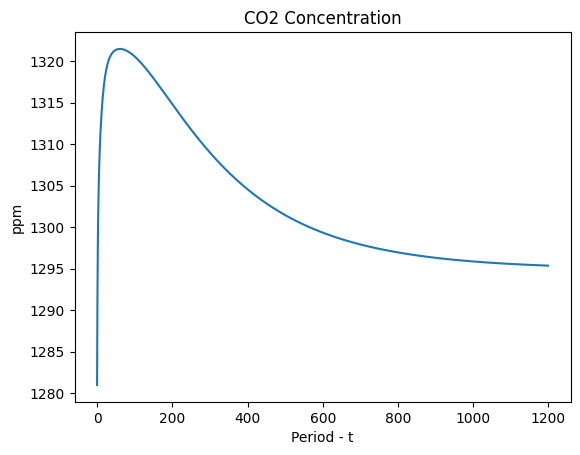
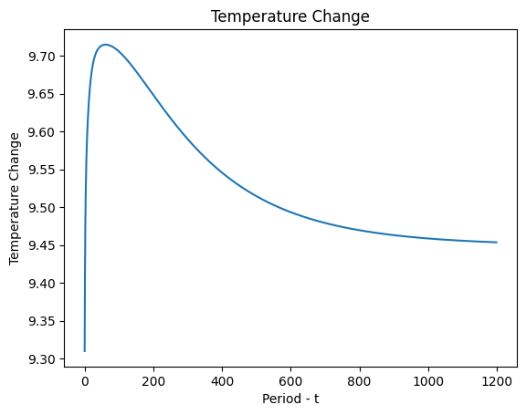

# **Atmosphere CO2 Concentration and Average Temperature Correlations**

**Thanks to my team: Bagas Alfian Firmansyah & Toriq Isnandar**

 

# **Problem Statement**

> **Book**: Heated Debate – Global Warming books - Project 7.5

Assume that there is a relationship between increasing concentrations of atmospheric carbon dioxide 
([CO2]) and average global temperature (T). Add these components to your carbon cycle model of 
Project 2 from Module 7.4, “What Goes Around Comes Around—The Carbon Cycle,” using the following 
relationships for CO2 concentration and change in temperature from the start to the end of the simulation, 
respectively:

|**Citation**|**Formula**|
|---|---|
|(Allmon et al. 2006)|[CO2] in ppm = 350 × (mass of CO2 in the atmosphere)/750|
|(Ward and Johnson 2004)|temperature change (oC) over entire period = 0.01([CO2] – 350)|

 

## **Flux Table**

> **Note**: 1 Gt carbon is equivalent to 3.66 Gt CO2.

 
 

 

## **Cycle Model**

 

**Model for Deforestation (Houghton et al. 1999)** - Suppose a fossil-fuel-deposits reservoir has an initial value of **4000 Gt** and **Fluxes Combustion = 5 Gt C/year**, and **Deforestation = 1.15 Gt/year** respectively. Assume that the rate of change of fossil fuel emissions has constrained growth with a **carrying capacity of 15 Gt C/year** and **growth rate of 0.03/year**

 

## **Conclusion**

From the simulation above, it can be concluded that there is a correlation between the rise of carbon dioxide's concentration in the atmosphere and the average temperature on earth. The more the amount of carbon dioxide on earth, it will cause the greenhouse effect. Although carbon dioxide is only one of several causes of the greenhouse effect, it is the main contributor to the greenhouse effect because the light emitted by sunlight is reflected back to the earth and is not absorbed in the atmosphere.